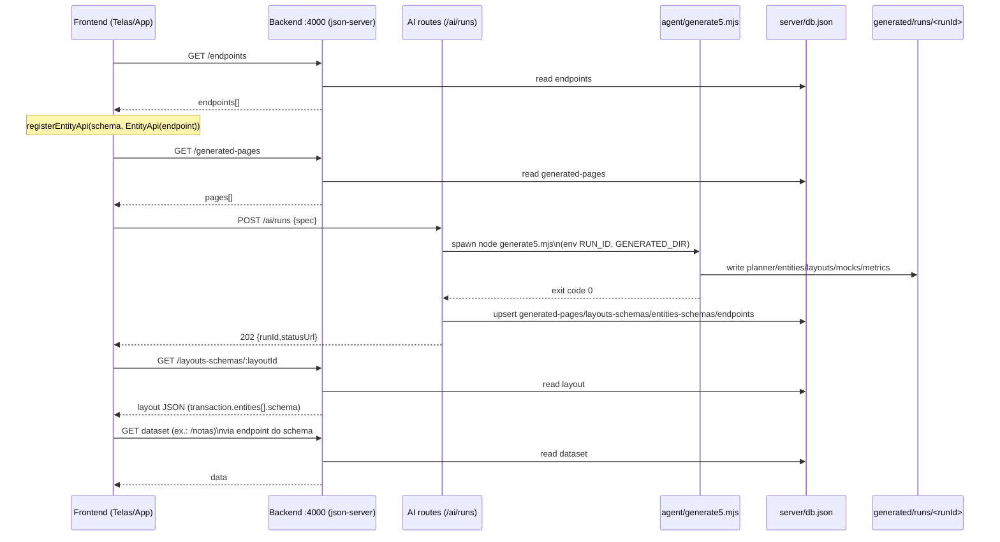

# Mapeamento (src → server → agent)

Este documento descreve o fluxo ponta-a-ponta do POC **ERPrompt Agent**, cobrindo:

- `src/`: frontend React (Vite) que renderiza telas dinâmicas via `@nasajon/erprompt-lib`
- `server/`: backend `json-server` com rotas extras para execução do gerador
- `agent/`: geradores que produzem JSON (planner, entidades, layouts e mocks)

Referências principais:

- Backend: `server/server3.cjs`, `server/ai-runs4.cjs`, `server/db.json`
- Agent: `agent/generate5.mjs`
- Frontend: `src/App.tsx`, `src/components/Telas.tsx`

## Resumo do fluxo

1. O frontend carrega:
   - Menu: `GET /launcher-itens` (usado por `@nasajon/erprompt-launcher-lib`)
   - Mapeamento de entidades: `GET /endpoints` (schema → endpoint), registrando `EntityApi` no `erprompt-lib`
   - Lista de telas: `GET /generated-pages` (para o dropdown em “Telas”)
2. Ao selecionar uma tela, o frontend renderiza `DynamicPage` com `layoutId` no formato `escopo.codigo` (ex.: `fiscal.list-notas-fiscais`).
3. O `erprompt-lib` busca o layout (via `erpromptApiUrl`) e, ao processar o `transaction.entities[].schema` dentro do layout, usa o `EntityApi` previamente registrado para carregar dados dos endpoints (datasets do `json-server`).
4. Para gerar novas telas/dados, o backend expõe `POST /ai/runs` que dispara o `agent/generate5.mjs`, grava outputs em `generated/runs/<runId>/...` e faz “commit” no `server/db.json` (coleções `generated-pages`, `layouts-schemas`, `entities-schemas`, `endpoints` e datasets).

## Rotas e coleções (server)

Servidor do POC: `npm run agent:serve` → `server/server3.cjs` (porta 4000).

- Rotas do `json-server` (baseadas em `server/db.json`)
  - `GET /launcher-itens` (resposta embrulhada em `{ result: ... }` por `server/server3.cjs`)
  - `GET /generated-pages`
  - `GET /layouts-schemas` e `GET /layouts-schemas/:id`
  - `GET /entities-schemas` e `GET /entities-schemas/:id`
  - `GET /endpoints`
  - Datasets (exemplos): `GET /notas`, `GET /pedido-vendas`, etc.
- Rotas extras (geração)
  - `POST /ai/runs` `{ "spec": "..." }` → dispara geração
  - `GET /ai/runs/:runId/status` → status do run (arquivo `generated/runs/<runId>/status.json`)
  - `GET /generated-pages/:id/layout` → retorna o JSON de layout do último `runId` associado (quando existir)

## Saídas do agent (generated/)

O `agent/generate5.mjs` grava em `generated/runs/<runId>/`:

- `planner.json` + `planner_prompt_compiled.md`
- `entities/<escopo>/<Codigo>.json`
- `layouts/<escopo>/<codigo>.json`
- `mocks/<escopo>/<Codigo>.mock.json`
- `metrics.json`

Ao final, o backend (`server/ai-runs4.cjs`) faz “commit” no `server/db.json`:

- `generated-pages`: lista de telas derivada do `planner.json`
- `layouts-schemas`: layouts completos (upsert por `id = escopo.codigo`)
- `entities-schemas`: entidades completas (upsert)
- `endpoints`: schema → endpoint (derivado dos mocks)
- datasets: `db.set(<resource>, items)` (ex.: `notas`, `pedido-vendas`)

## Observação importante (URLs hardcoded no frontend)

O frontend usa `http://localhost:4000` hardcoded em:

- `src/App.tsx` (fetch de `/endpoints`)
- `src/components/Telas.tsx` (fetch de `/generated-pages`)

Enquanto `erpromptApiUrl` já vem de `VITE_ERPROMPT_API_URL` (fallback `http://localhost:4000`).

## Diagrama (Mermaid)

### Fluxo geral

```mermaid
flowchart LR
  subgraph FE[Frontend (React + erprompt-lib)]
    App[src/App.tsx]
    Telas[src/components/Telas.tsx]
    ERL[@nasajon/erprompt-lib\nDynamicPage/DynamicPageRoute]
  end

  subgraph BE[Backend (json-server + rotas AI)]
    Srv[server/server3.cjs\n:4000]
    AIR[server/ai-runs4.cjs\nPOST /ai/runs]
    DB[(server/db.json\ncoleções + datasets)]
  end

  subgraph AG[Agent (geradores)]
    Gen[agent/generate5.mjs]
    Out[(generated/runs/<runId>/...)]
  end

  App -->|GET /endpoints| Srv --> DB
  App -->|registerEntityApi(schema → EntityApi(endpoint))| ERL

  Telas -->|GET /generated-pages| Srv --> DB
  Telas -->|DynamicPage(layoutId=escopo.codigo)| ERL
  ERL -->|GET /layouts-schemas/:id\n(via erpromptApiUrl)| Srv --> DB
  ERL -->|fetch entity data\n(schema → EntityApi)| Srv --> DB

  AIR -->|spawn node .../generate5.mjs\nRUN_ID + GENERATED_DIR| Gen --> Out
  Out -->|commit (generated-pages,\nlayouts-schemas, entities-schemas,\nendpoints + datasets)| DB
```

### Sequência (geração + consumo)



